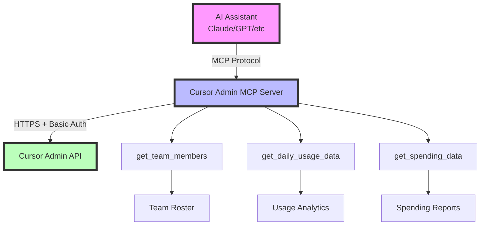
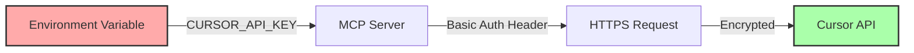

# Architecture Overview

## How Cursor Admin MCP Works

## Data Flow

1. **User Query**: "Show me team usage"
2. **AI Processing**: Understands intent, calls appropriate tool
3. **MCP Server**: Validates request, formats API call
4. **Cursor API**: Returns data with authentication
5. **Response Processing**: Formats data for human readability
6. **AI Response**: Natural language summary with insights

## Security Architecture

## Tool Architecture

### get_team_members
- **Endpoint**: GET /teams/members
- **Response**: Array of team members
- **Use Case**: Team roster, role verification

### get_daily_usage_data
- **Endpoint**: POST /teams/daily-usage-data
- **Parameters**: startDate, endDate (epoch ms)
- **Validation**: 90-day maximum range
- **Response**: Detailed metrics per user per day

### get_spending_data
- **Endpoint**: POST /teams/spend
- **Parameters**: Optional filters and pagination
- **Response**: Credit usage and costs
- **Features**: Search, sort, paginate